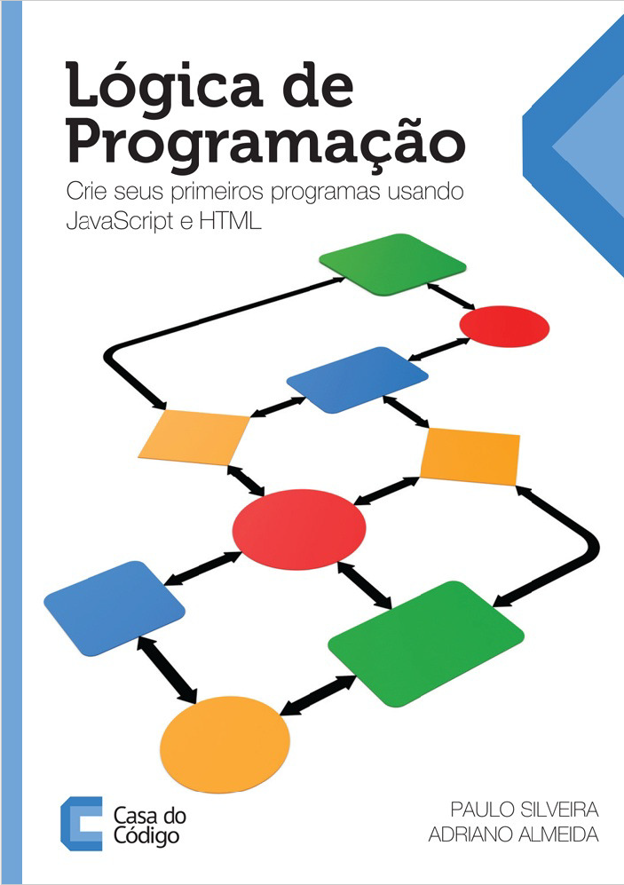

<h1>Exercícios resolvidos do livro Lógica de Programação - Crie seus primeiros programas usando Javascript e HTML</h1>

<h1> Exercícios separados por capítulo </h1>
<h3> Livro utilizado <a href="https://www.casadocodigo.com.br/products/livro-programacao"> Livro </a></h3>
<h3> Softwares utilizados:
<h3>Editor Atom:<a href="https://atom.io/"> Atom </a></h3>
<h3>Navegador Chrome: <a href="https://www.google.com/chrome/browser/desktop/index.html#"> Chrome </a></h3>

<h3>Extra: Curso online na Alura : <a href="https://cursos.alura.com.br/course/logica-programacao-javascript-html"> Curso Lógica de programação I: Os primeiros programas com Javascript e HTML </a>
<h2>Sumário

<h2>Sumário</h2>
<ul>
<li>1 - Comece a programar hoje</li>
<ul>
<li>1.1 - Converse com seu navegador</li>
<li>1.2 - Criando seu próprio arquivo HTML</li>
<li>1.3 - Um pouco mais de HTML</li>
<li>1.4 - Dê olá ao mundo</li>
<li>1.5 - Revise o código: seu primeiro programa</li>
<li>1.6 - Utilize o Chrome e o Notepad++</li>
<li>1.7 - Socorro! Meu programa não funciona. Conheça e use o console do Chrome</li>
<li>1.8 - Socorro! A acentuação não está funcionando corretamente</li>
</ul>
<li>2 - Comunique-se com o usuário</li>
<ul>
<li>2.1 - Dê olá ao mundo de outras formas</li>
<li>2.2 - Trabalhe com números</li>
<li>2.3 - Revisando o seu código: trabalhando com números</li>
<li>2.4 - Organize seus dados em variáveis</li>
<li>2.5 - Reescrevendo a média de idade dos seus amigos</li>
<li>2.6 - Revisando o seu código: organize-se com variáveis</li>
<li>2.7 - Pare de escrever BR tantas vezes!</li>
<li>2.8 - Revise o código: crie sua primeira função</li>
<li>2.9 - Funções passando informações e chamando outras funções</li>
<li>2.10 - Revise o código: usando a função mostra</li>
<li>2.11 - Mostrando mensagens secretas, apenas para o programador</li>
<li>2.12 - Para saber mais: comentários</li>
<li>2.13 - Compartilhe seu código com seus amigos!</li>
</ul>
<li>3 - Pratique resolvendo problemas do seu dia a dia</li>
<ul>
<li>3.1 - Como está seu peso? Saudável?</li>
<li>3.2 - Utilize uma função para calcular o IMC de cada amigo</li>
<li>3.3 - Revise o código: calculando o IMC</li>
<li>3.4 - Trabalhe com dados capturados: pergunte a altura e peso do usuário</li>
<li>3.5 - Exercícios: pergunte os dados do usuário para calcular o IMC</li>
<li>3.6 - Descubra quantos dias seus amigos já viveram</li>
<li>3.7 - Você já entendeu a ordem das chamadas das funções?</li>
<li>3.8 - Utilize o console do Chrome para fazer testes!</li>
</ul>
<li>4 - Execute códigos diferentes dependendo da condição</li>
<ul>
<li>4.1 - Quantos pontos tem seu time de futebol?</li>
<li>4.2 - Verifique a situação do seu time de futebol</li>
<li>4.3 - Revisando nosso código: pontos do campeonato</li>
<li>4.4 - O seu IMC está ideal?</li>
<li>4.5 - Jogo: adivinhe o número que estou pensando</li>
<li>4.6 - Revisando seu código: o jogo da adivinhação</li>
</ul>
<li>5 - Como repetir tarefas do programa?</li>
<ul>
<li>5.1 - Quando serão as próximas copas do mundo?</li>
<li>5.2 - Realize o loop somente em determinadas condições</li>
<li>5.3 - Revise seu código: mostre os anos de copas até cansar</li>
<li>5.4 - Caracteres e números, qual é a diferença afinal?</li>
<li>5.5 - Revise seu código: transforme texto em números</li>
<li>5.6 - Praticando mais um pouco: Faça tabuadas</li>
<li>5.7 - Aprenda uma forma diferente de mostrar a tabuada: o comando for</li>
<li>5.8 - Reescrevendo a tabuada com o for</li>
<li>5.9 - A média de idades, mas de uma forma mais interessante</li>
<li>5.10 - Jogo: Mais chances para adivinhar o número que estou pensando</li>
<li>5.11 - Revisando nosso código: O jogo da adivinhação dos números</li>
<li>5.12 - Exercícios: trabalhando com um loop dentro do outro</li>
</ul>
<li>6 - Arrays: trabalhe com muitos dados</li>
<ul>
<li>6.1 - Integre o JavaScript com HTML</li>
<li>6.2 - Revisando uso de HTML e criando o jogo</li>
<li>6.3 - Facilite o jogo da adivinhação colocando mais números!</li>
<li>6.4 - Evite os número repetidos no Bingo</li>
</ul>
<li>7 - Apêndice - Gráficos para deixar tudo mais interessante</li>
<ul>
<li>7.1 - Desenhe linhas e figuras</li>
<li>7.2 - Criando todo tipo de imagem</li>
<li>7.3 - Não vou conseguir lembrar de tudo isso! APIs e bibliotecas</li>
<li>7.4 - Revise seus primeiros passos com o canvas</li>
<li>7.5 - Cansei de repetir código! Funções novamente</li>
<li>7.6 - Loops e funções para nos ajudar</li>
</ul>
<li>8 - Apêndice - Animações e pequenos jogos</li>
<ul>
<li>8.1 - Crie uma lousa capturando o movimento do mouse</li>
<li>8.2 - Exercícios para nossa tela de desenho</li>
<li>8.3 - Crie animações</li>
<li>8.4 - Revise e faça novas animações</li>
<li>8.5 - Desafio: o jogo do tiro ao alvo</li>
</ul>
<li>9 - Últimas palavras - Além da lógica de programação</li>
<ul>
<li>9.1 - Objetos</li>
<li>9.2 - Boas práticas que foram violadas durante o aprendizado</li>
<li>9.3 - Pratique muito!</li>
<li>9.4 - Continue seus estudos</li>
</ul>
</ul>

